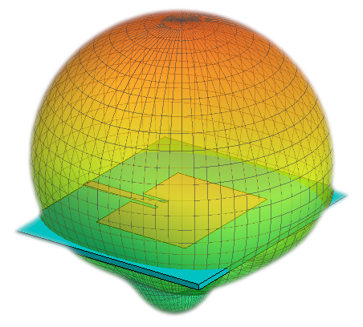

  

# Microstrip Antenna
Design and implementation of microstrip antenna. The idea is to improve the connectivity of a home WIFI link for G and N standards.

## Specs

* Resonance Frequency (fr): 2.422 GHz
* SWR < 2 with BW > 44 MHz
* Directivity > 3dB

## Substrate

* Material: FR4
* Substrate height (h): 1.6 mm
* Relative dielectric constant of substrate: 4.5
* Loss tangent: 0.0025

## Dimensions

  

<table align="center">
  <tr>
    <th align="center">Dimension</th>
    <th align="center">Value</th>
    <th align="center">Unit</th>
  </tr>
  <tr>
    <td align="center">t</td>
    <td align="center">35</td>
    <td align="center">µm</td>
  </tr>
  <tr>
    <td align="center">h</td>
    <td align="center">1.6</td>
    <td align="center">mm</td>
  </tr>
  <tr>
    <td align="center">W</td>
    <td align="center">37.35</td>
    <td align="center">mm</td>
  </tr>
  <tr>
    <td align="center">L</td>
    <td align="center">28.55</td>
    <td align="center">mm</td>
  </tr>
  <tr>
    <td align="center">Wg</td>
    <td align="center">70</td>
    <td align="center">mm</td>
  </tr>
  <tr>
    <td align="center">Lg</td>
    <td align="center">60</td>
    <td align="center">mm</td>
  </tr>
  <tr>
    <td align="center">W0</td>
    <td align="center">3.05</td>
    <td align="center">mm</td>
  </tr>
  <tr>
    <td align="center">g</td>
    <td align="center">1.4</td>
    <td align="center">mm</td>
  </tr>
  <tr>
    <td align="center">y0</td>
    <td align="center">7.94</td>
    <td align="center">mm</td>
  </tr>
</table>

## Layout and Finished Antenna

  
  

## Radiation Pattern: E and H Planes

The polarization of the microstrip antenna is linear such that the electric field vector is contained in the E-Plane and the magnetic field vector is contained in the H-Plane. It is observed that the type of power chosen considerably disturbs the radiation pattern of the antenna in E-Plane.

  

The results of measurements and simulations are shown below.

<table align="center">
    <tr>
      <th align="center">H-Plane</th>
      <th align="center">E-Plane</th>
    </tr>
    <tr>
      <th align="center">
        
      </th>
      <th align="center">
        
      </th>
    </tr>
    <tr>
      <td align="left">
        Simulation:
        <ul>
          <li>G @ 2.4220 GHz = 3.8 dB</li>
          <li>SLL @ 2.4220 GHz = 16 dB</li>
          <li>Δθ -3dB @ 2.4220 GHz = 82°</li>
        </ul>
        Measurement:
        <ul>
          <li>SLL @ 2.4824 GHz = 6.8 dB</li>
          <li>Δθ(-3dB) @ 2.4220 GHz = 82°</li>
        </ul>
      </td>
      <td align="left">
        Simulation:        
        <ul>
          <li>G @ 2.4220 GHz = 3.8 dB</li>
          <li>SLL @ 2.4220 GHz = 16 dB</li>
          <li>Δθ(-3dB) @ 2.4220 GHz = 93°</li>
        </ul>
        Measurement:
        <ul>
          <li>SLL @ 2.4824 GHz = 10 dB</li>
          <li>Δθ -3dB @ 2.4220 GHz = 105°</li>
        </ul>
      </td>
    </tr>
</table>

## 3D Radiation Pattern

  
  

## References
* C. A. Balanis, Antenna Theory: Analysis and Design, Third Edition, Wiley-Interscience, 2005.
* Warren L. Stutzman, Gary A. Thiele, Antenna Theory and Design, Third Edition, Wiley-Interscience, 2013.
